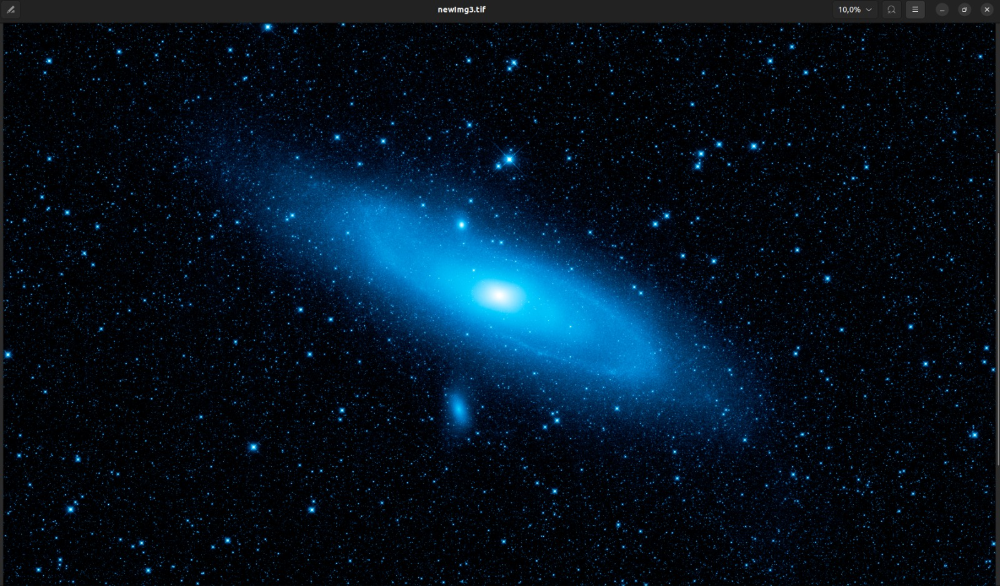

# **Codefest Ad Astra 2024 - Cifrado y Descifrado Satelital**

Este proyecto implementa una solución criptográfica para el cifrado y descifrado de imágenes satelitales, cumpliendo con los requisitos del **Codefest Ad Astra 2024**. La solución está diseñada para sistemas embebidos y utiliza llaves dinámicas para garantizar la seguridad de las comunicaciones entre satélites y estaciones terrenas.

## **Contenido**

- [**Codefest Ad Astra 2024 - Cifrado y Descifrado Satelital**](#codefest-ad-astra-2024---cifrado-y-descifrado-satelital)
  - [**Contenido**](#contenido)
  - [**Descripción del Proyecto**](#descripción-del-proyecto)
  - [**Requisitos**](#requisitos)
  - [**Instalación**](#instalación)
  - [**Compilación**](#compilación)
    - [**En Linux/Unix**](#en-linuxunix)
    - [**En Windows**](#en-windows)
  - [**Ejecución**](#ejecución)
  - [**Estructura del Proyecto**](#estructura-del-proyecto)
  - [**Detalles Técnicos**](#detalles-técnicos)
    - [**Cifrado**](#cifrado)
    - [**Descifrado**](#descifrado)
    - [**Llaves Dinámicas**](#llaves-dinámicas)
  - [**Verificación y Validación**](#verificación-y-validación)
  - [**Ejemplo de imagen cifrada**](#ejemplo-de-imagen-cifrada)
  - [**Capturas de salida del cifrado y descifrado**](#capturas-de-salida-del-cifrado-y-descifrado)
  - [**Autores**](#autores)


## **Descripción del Proyecto**

Este proyecto aborda el problema de **ciberseguridad en misiones satelitales**. El objetivo es diseñar e implementar algoritmos de cifrado y descifrado de imágenes satelitales usando llaves dinámicas y cumpliendo con los requerimientos de sistemas embebidos de baja capacidad.

La solución está diseñada para ejecutarse en un **Jetson Nano** y hace uso de técnicas avanzadas de criptografía.

## **Requisitos**

- **Sistemas embebidos**: El código está optimizado para ejecutarse en una Jetson Nano con un límite de **4 GB de RAM**.
- **Librerías**:
  - `libcrypto` para el cifrado/descifrado usando **OpenSSL**.
- **Lenguaje**: C/C++
- **Herramientas**: 
  - CMake para la compilación.
  - Jetson Nano con Ubuntu (ya configurado en la competencia).

## **Instalación**

1. Clonar este repositorio:
   ```bash
   git clone https://github.com/AIr-Reinforcement-AdAstra2024/CodefestAdAstra2024
   cd CodefestAdAstra2024
   ```

2. Instalar las dependencias necesarias (en caso de que no estén instaladas en el entorno de la Jetson Nano):
   ```bash
   sudo apt-get install libcrypto++-dev
   ```

## **Compilación**

### **En Linux/Unix**

Para compilar el código, ejecutar el siguiente comando:

```bash
./build.sh
```

Este comando generará el ejecutable `CodefestAdAstra2024.sh` dentro del directorio. Para ejecutar el programa:

```bash
./CodefestAdAstra2024.sh
```

### **En Windows**

Existen varias opciones para compilar el código en Windows. A continuación, se detallan algunos métodos:

- **MinGW**:
  1. Instalar `mingw32-make`.
  2. Navegar a la carpeta del proyecto: `CodefestAdAstra2024/build`.
  3. Ejecutar:
     ```bash
     mingw32-make
     ```

- **Visual Studio**:
  1. Abrir la carpeta del proyecto en Visual Studio.
  2. Ejecutar `nmake` desde la terminal.

- **CMake** (experimental):
  Ejecutar:
  ```bash
  ./build.bat
  ```

## **Ejecución**

Para ejecutar el programa, después de la compilación, usar el siguiente comando:

```bash
./CodefestAdAstra2024.sh <ruta_imagen_entrada> <ruta_imagen_salida>
```

## **Estructura del Proyecto**

```plaintext
├── include/                 # Archivos de cabecera
│   ├── cipher.h             # Definiciones para cifrado y descifrado
│   ├── GroundStation.hpp    # Lógica de la estación terrena
│   └── Satellite.hpp        # Lógica del satélite
├── src/                     # Código fuente
│   ├── cipher.cc            # Implementación de las funciones de cifrado/descifrado
│   ├── GroundStation.cpp    # Implementación de la estación terrena
│   ├── Satellite.cpp        # Implementación del satélite
│   └── main.cpp             # Programa principal
├── images/                  # Imágenes de prueba
├── Diagramas/               # Diagramas UML del proyecto
├── README.md                # Archivo README
└── Documento_de_diseño___CodefestAdAstra2024.pdf  # Documento detallado del diseño del proyecto
```

## **Detalles Técnicos**

### **Cifrado**

El algoritmo de cifrado se encuentra en `cipher.cc` y utiliza la librería **OpenSSL** para implementar el cifrado simétrico basado en **AES-256**. Este esquema garantiza la integridad y seguridad de los datos en la comunicación satelital. El algoritmo toma como entrada los datos de la imagen y los cifra usando la llave dinámica generada.

```cpp
void encryptImage(const std::string &inputPath, const std::string &outputPath);
```

### **Descifrado**

El descifrado sigue un esquema simétrico, utilizando **OpenSSL** y la misma llave que el cifrado para restaurar la imagen original. El descifrado asegura que no haya pérdida de calidad en los datos de la imagen después de la operación.

```cpp
void decryptImage(const std::string &inputPath, const std::string &outputPath);
```

### **Llaves Dinámicas**

El manejo de llaves dinámicas es crucial en este proyecto. Las llaves no se almacenan localmente, sino que se generan dinámicamente de manera independiente en el satélite y en la estación terrena utilizando **OpenSSL** para asegurar que las llaves sean únicas y seguras. Esto garantiza que no se pueda interceptar ni manipular la llave durante la comunicación.

## **Verificación y Validación**

Para garantizar la calidad del código, se recomienda el uso de las herramientas de análisis estático **Facebook Infer** y **SonarQube**. Estas herramientas permiten identificar posibles errores o vulnerabilidades en el código.

1. **Facebook Infer**:
   ```bash
   infer run -- make
   ```

2. **SonarQube**:
   Configurar el proyecto en SonarQube para realizar un análisis exhaustivo del código fuente.


## **Ejemplo de imagen cifrada**

La siguiente es una imagen de muestra utilizada para las pruebas de cifrado y descifrado en este proyecto:



## **Capturas de salida del cifrado y descifrado**

A continuación, se muestran las salidas de consola durante el proceso de cifrado y descifrado de la imagen:

1. **Cifrado de la imagen**:
   ```bash
   time ./main encrypt image3.tif out.enc
   
   input_path=image3.tif
   output_path=out.enc
   Encrypted image
   
   real    0m3,822s
   user    0m2,532s
   sys     0m1,260s
   ```

2. **Descifrado de la imagen**:
   ```bash
   time ./main decrypt out.enc newImg3.tif
   
   input_path=out.enc
   output_path=newImg3.tif
   Decrypted image
   
   real    0m41,967s
   user    0m41,012s
   sys     0m0,836s
   ```

## **Autores**

- **Sergio Oliveros**
- **Daniel Álvarez**
- **Sebastian Urrea**
- **Haider Fonseca**
- **Daniel Perea**
